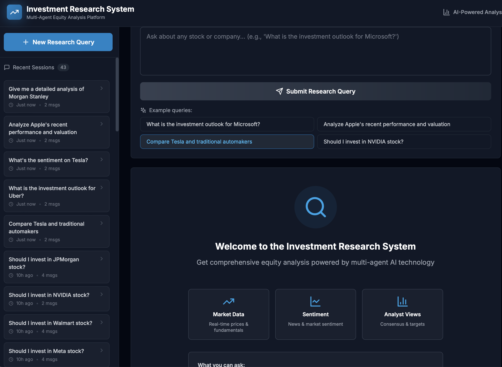
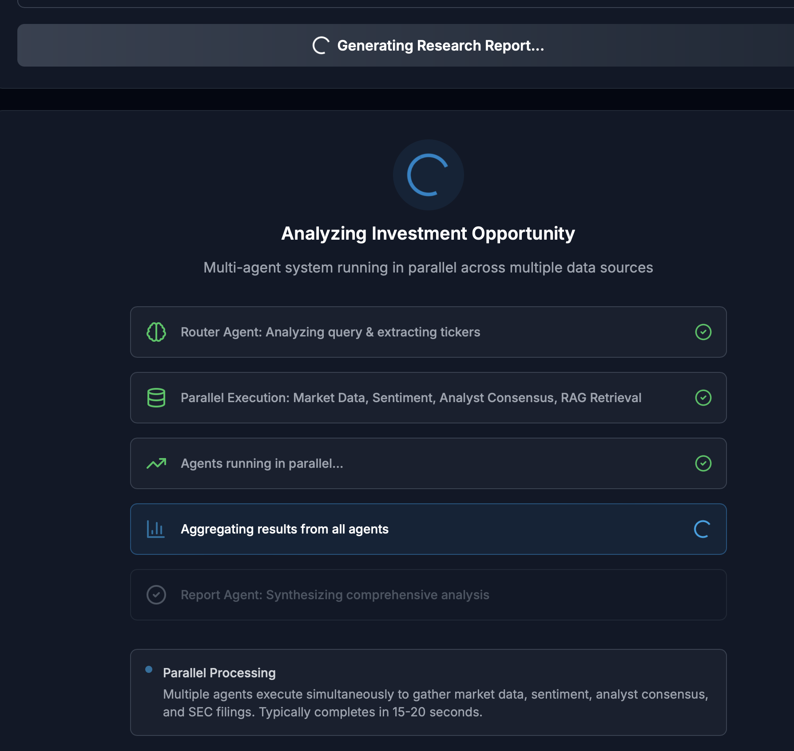
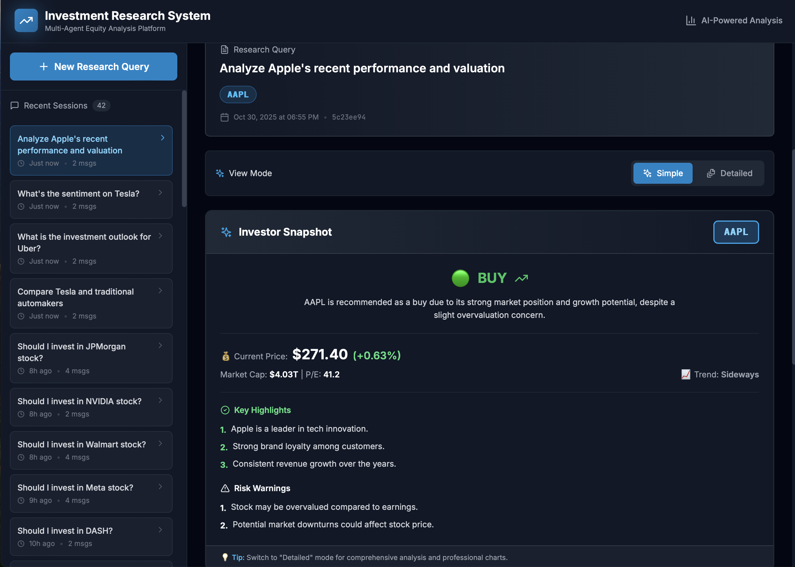
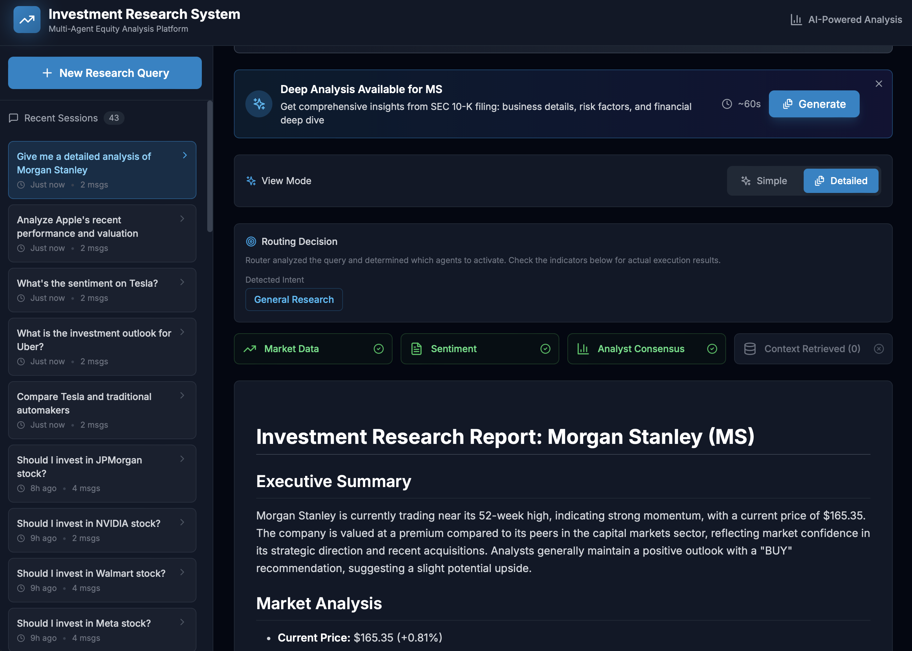
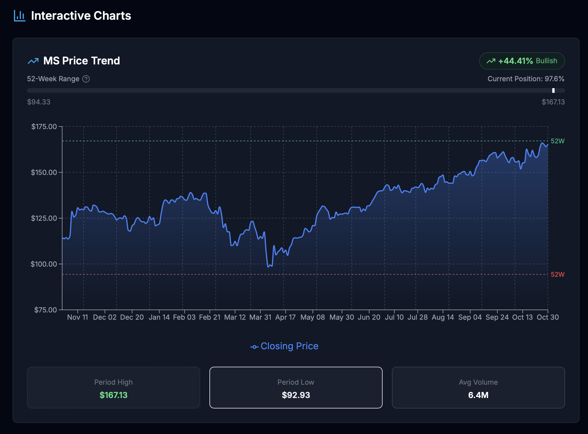
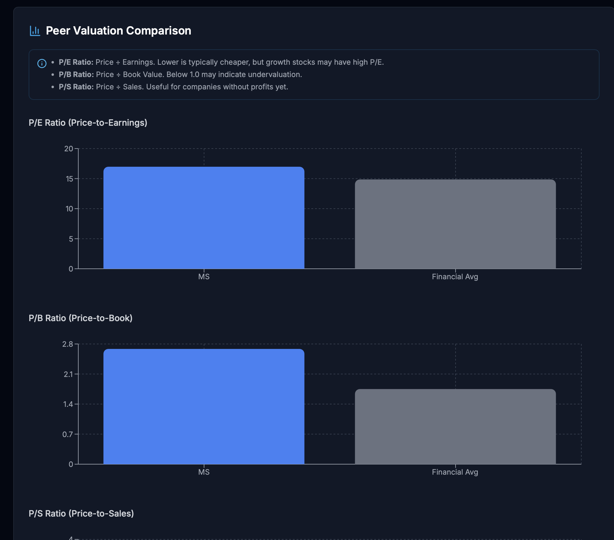

# Multi-Agent Investment Research System


A multi-agent equity research system that produces **BUY / NEUTRAL / SELL** decisions by fusing three independent analysis agents through a **deterministic mathematical Decision Hub**. No LLM is involved in the decision itself — only in generating human-readable explanations after the math is done.

### Highlights

- **Deterministic decisions** — the Decision Hub is a pure mathematical function; same inputs always produce the same output
- **Three distinct reasoning patterns** — ReAct, FinBERT Funnel, Plan-and-Solve, each matched to its data modality
- **Sub-3s median latency** — three agents execute in parallel with independent timeouts
- **Graceful degradation** — produces calibrated decisions even when 1–2 agents fail
- **Hybrid RAG** — Reciprocal Rank Fusion over SEC 10-K filings, 0.82 recall@5
- **Domain-specific ML** — FinBERT replaces LLM for sentiment (50x cheaper, deterministic, F1=0.94 on financial text)
- **294 tests** across unit, integration, and E2E layers

---

## Architecture


The LLM generates reasoning *after* the decision is finalized and is contractually forbidden from altering the mathematical output. This separation ensures auditability and reproducibility — the decision can be fully explained by inspecting the consistency score, weight allocations, and aggregated score without any LLM interpretation.

---

## Why This Architecture

| Problem with typical LLM approaches | How this system addresses it |
|--------------------------------------|------------------------------|
| Prompt sensitivity flips BUY to SELL | Deterministic math — no prompt involved in the decision |
| Same input, different output across runs | Pure function: identical signals always yield identical decisions |
| Black-box reasoning | Every intermediate value exposed: direction gate, strength spread, regime weights |
| Expensive sentiment inference | FinBERT local inference — 50x cheaper than GPT-5, deterministic |
| Single point of failure | 3 independent agents; 2-agent mode maintains 87% directional agreement |

---

## Agents

### Technical Agent — ReAct

Implements a **Reason + Act** loop via OpenAI function calling. The LLM dynamically selects from 6 indicator tools based on intermediate results. The mandatory first step — `market_regime` — classifies the market as TRENDING, RANGING, or HIGH_VOLATILITY and sets regime-aware thresholds for all subsequent tools.

Typical analysis completes in **2–4 steps, ~1.8s per ticker**.

### Sentiment Agent — FinBERT Funnel

A **zero-LLM pipeline** that processes financial news through three layers: relevance filtering with deduplication, FinBERT batch classification (~0.3s for 25 articles on CPU), and weighted aggregation with exponential time decay and source credibility scoring. The funnel narrows ~50 raw articles down to a single signal.

### Fundamental Agent — Plan-and-Solve + RAG

A 4-step structured pipeline: **profile** the company, **plan** analysis tasks, **execute** via RAG retrieval on SEC 10-K filings + financial data tools, then **synthesize** with cross-task consistency checking. The RAG pipeline uses hybrid retrieval (dense + BM25) with Reciprocal Rank Fusion, achieving **0.82 recall@5** on structured financial documents.

---

## Decision Hub

The core innovation. A **three-stage mathematical pipeline** that fuses heterogeneous agent signals into a single actionable decision — no LLM, no heuristics, fully deterministic.

**Stage 1 — Consistency Scoring:** Measures inter-agent agreement across direction, strength, and confidence dimensions. A superlinear penalty (exponent 1.5) on directional disagreement aggressively punishes conflicting signals — this is the primary risk gate.

**Stage 2 — Dynamic Weighting:** Agent base weights are adjusted by market regime modifiers (technical analysis gets boosted in trending markets; fundamentals anchor in high-volatility regimes) and each agent's own confidence. Weights are always normalized to sum to 1.0.

**Stage 3 — Aggregation:** A weighted sum of directional signals produces a continuous score, which is classified into BUY / NEUTRAL / SELL via symmetric thresholds. The consistency score determines the risk mode (NORMAL / CAUTIOUS / RISK), which applies a final confidence dampener.

### Graceful Degradation

| Active Agents | Confidence Impact | Behavior |
|:---:|:---:|---|
| 3 / 3 | Full | Normal analysis |
| 2 / 3 | ×0.8 | Warning issued |
| 1 / 3 | ×0.5 | Strong warning |
| 0 / 3 | — | HTTP 503 |

---

## Performance

| Metric | Value |
|--------|-------|
| Median end-to-end latency | **2.8s** |
| P95 latency | 5.2s |
| FinBERT inference | 0.3s / 25 articles (CPU) |
| Decision Hub computation | <5ms |
| Memory footprint | ~1.2 GB (FinBERT loaded) |

---

## Tech Stack

| Layer | Technology |
|-------|-----------|
| API | FastAPI, Pydantic v2 |
| Orchestration | asyncio.gather with per-agent timeouts |
| Technical Analysis | OpenAI GPT-5 function calling, `ta` indicators |
| Sentiment Analysis | ProsusAI/FinBERT (local inference) |
| Fundamental Analysis | OpenAI GPT-5 + hybrid RAG |
| RAG | Qdrant, LlamaIndex, sentence-transformers, RRF fusion |
| Data Sources | yfinance, Finnhub API, SEC EDGAR (edgartools) |
| Frontend | React 18, TypeScript, Tailwind CSS |
| Domain Models | Frozen Pydantic v2 (immutable value objects) |
| Testing | pytest — 294 tests across unit / integration / E2E |

---

## Quick Start

```bash
git clone https://github.com/flash131307/multi-agent-investment.git
cd multi-agent-investment

# Backend
python -m venv .venv && source .venv/bin/activate
pip install -r requirements.txt

# Frontend
cd frontend && npm install && cd ..

# Configure
cp .env.template .env   # Fill in OPENAI_API_KEY, FINNHUB_API_KEY

# Run
uvicorn backend.main:app --reload --port 8000   # Terminal 1
cd frontend && npm run dev                        # Terminal 2
```

Frontend: http://localhost:5173 · API docs: http://localhost:8000/docs

---

## API

```bash
curl -X POST http://localhost:8000/api/research/analyze \
  -H "Content-Type: application/json" \
  -d '{"ticker": "AAPL"}'
```

<details>
<summary>Example response</summary>

```json
{
  "ticker": "AAPL",
  "decision": {
    "direction": "BUY",
    "confidence": 0.72,
    "risk_mode": "NORMAL",
    "consistency_score": 0.85,
    "aggregated_score": 0.416,
    "reasoning": "All three agents signal positive outlook..."
  },
  "agents": [
    {"agent_name": "technical", "direction": "BUY", "strength": "STRONG", "confidence": 0.85},
    {"agent_name": "sentiment", "direction": "BUY", "strength": "MODERATE", "confidence": 0.68},
    {"agent_name": "fundamental", "direction": "BUY", "strength": "MODERATE", "confidence": 0.71}
  ],
  "warnings": []
}
```

</details>

---

## Project Structure

```
backend/
├── agents/
│   ├── technical/          # ReAct agent + 6 indicator tools
│   ├── sentiment/          # FinBERT 3-layer funnel
│   └── fundamental/        # Plan-and-Solve + RAG tools
├── decision_hub/           # Consistency → Weighting → Aggregation
├── models/                 # Frozen Pydantic v2 domain models
├── rag/                    # EDGAR loader, chunker, embedder, hybrid retriever
├── orchestrator/           # Parallel execution + graceful degradation
├── services/               # Yahoo Finance, Finnhub, FinBERT, ticker resolver
└── config/                 # Environment-based settings
frontend/                   # React + TypeScript + Tailwind
tests/
├── unit/                   # 12 test modules
├── integration/            # 5 test modules
└── e2e/                    # API endpoint tests
```

---

## Appendix: Previous Version UI

The original system used a **chat-style research query interface** — users typed free-form questions, a Router Agent extracted tickers, and the system returned a long-form markdown report with embedded charts. This version was refactored into the current 3-agent + Decision Hub architecture to achieve deterministic, auditable decisions.

<details>
<summary>Click to view pre-refactor screenshots (6 images)</summary>

**Home — Research Query Interface**


**Analysis in Progress — Parallel Agent Execution**


**Results — Simple View (Investor Snapshot)**


**Results — Detailed View (Full Research Report)**


**Interactive Charts — Price Trend**


**Interactive Charts — Peer Valuation Comparison**


</details>

---

## License

MIT — see [LICENSE](LICENSE) for details.
