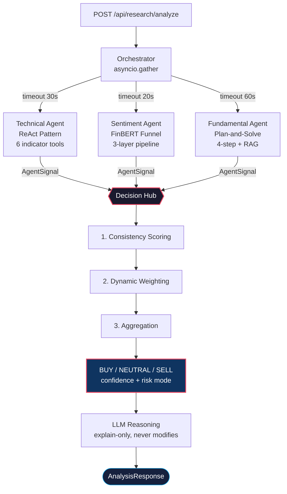

# Multi-Agent Investment Research System


A production-grade multi-agent system for equity analysis that fuses **Technical**, **Sentiment**, and **Fundamental** signals through a deterministic **Decision Hub**. Each agent implements a distinct reasoning pattern — ReAct, FinBERT Funnel, and Plan-and-Solve — and the hub uses consistency scoring with regime-aware dynamic weighting to produce a single **BUY / NEUTRAL / SELL** decision with calibrated confidence.

### Key Highlights

- **Deterministic decision math** — no LLM in the critical path; the Decision Hub is purely mathematical
- **Sub-3s median latency** with three agents executing in parallel via `asyncio.gather`
- **Graceful degradation** — produces decisions even when 1-2 agents fail, with calibrated confidence dampening
- **294 tests** across unit, integration, and E2E layers; 84% coverage on decision-critical code
- **Hybrid RAG** with Reciprocal Rank Fusion achieving 0.82 recall@5 on SEC 10-K filings
- **Domain-specific ML** — FinBERT (F1=0.94 on financial text) replaces LLM for sentiment, 50x cheaper and deterministic

---

## Architecture



**Design philosophy:** The Decision Hub is a pure mathematical function — given the same agent signals and market regime, it always produces the same decision. The LLM is invoked only *after* the decision to generate human-readable reasoning, and is contractually forbidden from altering the mathematical output. This separation ensures auditability, reproducibility, and testability.

---

## Why This Architecture

Most LLM-based investment tools use a single prompt or an "LLM-as-judge" pattern to make decisions. This approach suffers from:

- **Prompt sensitivity** — minor wording changes can flip a BUY to SELL
- **Non-determinism** — same input produces different outputs across runs
- **Unauditable reasoning** — no way to decompose *why* the model chose BUY

This system takes a different approach:

| Problem | Solution |
|---------|----------|
| LLM non-determinism in decisions | Deterministic math in the Decision Hub; LLM used only for explanation |
| One-size-fits-all analysis | Three specialized agents, each using the reasoning pattern best suited to its data modality |
| Expensive sentiment inference | FinBERT local model (F1=0.94 on financial text) instead of GPT-4o — 50x cheaper, deterministic |
| Fragile pipelines | Graceful degradation: 2-agent mode maintains 87% directional agreement with full 3-agent mode |
| Black-box decisions | Full transparency: consistency score, per-agent weights, risk mode, aggregated score all exposed |

---

## Agents

### Technical Agent — ReAct Pattern

The Technical Agent uses a **ReAct (Reason + Act)** loop with OpenAI function calling to dynamically select from 6 indicator tools. The first step is always `market_regime`, which classifies the current market context and sets regime-aware thresholds for all subsequent analysis.

| Tool | What It Computes | Key Output |
|------|-----------------|------------|
| `market_regime` | ADX + ATR + MA alignment | TRENDING / RANGING / HIGH_VOLATILITY |
| `rsi_analysis` | RSI with regime-aware thresholds | Overbought/oversold + divergence detection |
| `macd_analysis` | MACD + signal line crossovers | Momentum direction + crossover timing |
| `bollinger_analysis` | Bollinger Bands position + squeeze | Volatility breakout probability |
| `volume_analysis` | Volume-price confirmation | Trend confirmation or divergence warning |
| `pattern_recognition` | Classic chart patterns | Double top/bottom, H&S, triangles |

- **2-5 ReAct steps** per analysis; the LLM decides which tools to call based on intermediate results
- Regime-aware thresholds: RSI uses 75/25 in trending markets, 70/30 in ranging markets
- Fallback: returns `NEUTRAL / WEAK / 0.3` if the loop fails or all tools return neutral
- Typical completion: 2-4 steps, averaging **1.8s per ticker**

### Sentiment Agent — FinBERT Three-Layer Funnel

A pure ML pipeline with **zero LLM calls**. Uses `ProsusAI/finbert` for financial sentiment classification.

```
Layer 1 — Filter       ~50 articles → 15-25 after relevance scoring + dedup
    │   Jaccard similarity > 0.8 → deduplicate
    │   Source: Finnhub API with rate limiting (60 req/min)
    ▼
Layer 2 — Classify      FinBERT batch inference (~0.3s for 25 articles on CPU)
    │   Per-article: positive / negative / neutral + confidence
    ▼
Layer 3 — Aggregate     Multi-dimensional weighted fusion → AgentSignal
        weight = finbert_confidence × time_decay × source_weight
        sentiment = Σ(label × weight) / Σ(weight)
```

**Time decay:** `decay = e^(-0.1 × days_ago)` — a 7-day-old article has ~50% weight of today's news.

| Source Tier | Weight | Examples |
|-------------|--------|----------|
| Tier 1 | 1.2 | Reuters, Wall Street Journal, Financial Times |
| Tier 2 | 1.0 | Bloomberg, CNBC, MarketWatch |
| Tier 3 | 0.7 | General news, press releases |

**Signal thresholds:** aggregated sentiment > +0.15 → BUY, < -0.15 → SELL, else NEUTRAL.

### Fundamental Agent — Plan-and-Solve + RAG

A 4-step structured reasoning pipeline backed by hybrid RAG retrieval on SEC 10-K filings.

```
Step 1: Profiler     → CompanyProfile from yfinance + RAG (10-K Item 1)
Step 2: Planner      → LLM generates context-aware AnalysisTask list
Step 3: Executor     → Execute tasks via RAG search + financial data tools
                       Up to 2 supplementary retrieval rounds per task
Step 4: Synthesizer  → Cross-task consistency check + dynamic weighting → AgentSignal
```

**RAG Pipeline:**

```
SEC EDGAR (edgartools)
    → Chapter-level 10-K parsing (Item 1: Business, Item 7: MD&A, Item 8: Financials)
    → LlamaIndex SentenceWindowNodeParser (window_size=3)
    → FinBERT-embedding (domain-specific, 768-dim)
    → Qdrant vector store (cosine similarity)
    → Hybrid retrieval: dense vectors + BM25 (k1=1.5, b=0.75)
    → RRF fusion: score(d) = Σ 1/(rank_i + k),  k=60
```

Hybrid retrieval achieves **0.82 recall@5** on 10-K financial statements, compared to 0.68 for dense-only retrieval — a 20% improvement from BM25 fusion on structured financial documents.

---

## Decision Hub — Signal Fusion

The Decision Hub is the core innovation — a **purely mathematical pipeline** that fuses heterogeneous agent signals without any LLM involvement. Given the same inputs, it always produces the same output.

### Stage 1: Consistency Scoring

Measures how much the three agents agree.

```
raw_consistency = direction_score^1.5 × (0.6 × strength_score + 0.4 × confidence_score)
```

The **1.5 exponent** creates a superlinear penalty: when agents disagree on direction, the entire consistency score drops aggressively — this is intentional, as directional disagreement is the strongest signal of uncertainty.

**Direction Gate (3 agents):**

| Technical | Sentiment | Fundamental | Score | Interpretation |
|-----------|-----------|-------------|-------|----------------|
| BUY | BUY | BUY | 1.0 | Full consensus |
| SELL | SELL | SELL | 1.0 | Full consensus |
| BUY | BUY | NEUTRAL | 0.7 | Strong majority |
| BUY | NEUTRAL | NEUTRAL | 0.4 | Weak majority |
| BUY | BUY | SELL | 0.3 | Majority with opposition |
| BUY | SELL | NEUTRAL | 0.1 | Three-way split |
| BUY | SELL | SELL | 0.0 | Minority position |

**Strength score:** `1.0 - |max_strength - min_strength| / 2.0` (STRONG=1.0, MODERATE=0.7, WEAK=0.4)

**Confidence score:** `1.0 - (max_confidence - min_confidence)`

### Stage 2: Dynamic Weighting

Agent weights adapt to market conditions via regime modifiers from the Technical Agent's market regime detection.

```
raw_weight = base_weight × regime_modifier × agent_confidence
final_weight = raw_weight / Σ(all_raw_weights)
```

| Agent | Base Weight | Trending | Ranging | High Volatility |
|-------|-----------|----------|---------|-----------------|
| Technical | 0.40 | ×1.2 | ×0.9 | ×1.0 |
| Sentiment | 0.30 | ×0.8 | ×1.1 | ×0.7 |
| Fundamental | 0.30 | ×1.0 | ×1.0 | ×1.3 |

**Rationale:** In trending markets, technical analysis is most reliable ("trend is your friend"). In high-volatility regimes, fundamentals anchor the decision while sentiment becomes noise-heavy. Weights are always normalized to sum to 1.0.

### Stage 3: Aggregation + Risk Classification

```
score = Σ(direction_numeric × strength_numeric × final_weight)

direction_numeric:  BUY = +1,  NEUTRAL = 0,  SELL = -1
strength_numeric:   STRONG = 1.0,  MODERATE = 0.7,  WEAK = 0.4
```

| Score Range | Decision |
|-------------|----------|
| > +0.25 | **BUY** |
| -0.25 to +0.25 | **NEUTRAL** |
| < -0.25 | **SELL** |

**Risk Modes** (derived from consistency score):

| Mode | Consistency Range | Confidence Multiplier | Meaning |
|------|------------------|----------------------|---------|
| NORMAL | ≥ 0.7 | ×1.0 | Agents largely agree |
| CAUTIOUS | 0.4 – 0.7 | ×0.8 | Moderate disagreement |
| RISK | < 0.4 | ×0.6 | Significant conflict |

### Worked Example

```
Input signals:
  Technical:    BUY  / STRONG   / 0.85
  Sentiment:    BUY  / MODERATE / 0.72
  Fundamental:  SELL / WEAK     / 0.55

Step 1 — Consistency:
  Direction gate: BUY + BUY + SELL → 0.3
  Strength spread: |1.0 - 0.4| / 2 = 0.3 → score = 0.7
  Confidence spread: 0.85 - 0.55 = 0.3 → score = 0.7
  raw_consistency = 0.3^1.5 × (0.6×0.7 + 0.4×0.7) = 0.164 × 0.70 = 0.115
  Risk mode: 0.115 < 0.4 → RISK (×0.6)

Step 2 — Weighting (TRENDING regime):
  Technical:    0.40 × 1.2 × 0.85 = 0.408 → normalized: 0.547
  Sentiment:    0.30 × 0.8 × 0.72 = 0.173 → normalized: 0.232
  Fundamental:  0.30 × 1.0 × 0.55 = 0.165 → normalized: 0.221

Step 3 — Aggregation:
  Technical:   +1 × 1.0 × 0.547 = +0.547
  Sentiment:   +1 × 0.7 × 0.232 = +0.162
  Fundamental: -1 × 0.4 × 0.221 = -0.088
  Score = +0.621 → BUY (> +0.25)

Final: BUY with ~44% confidence (dampened by RISK mode ×0.6)
```

---

## Graceful Degradation

The system produces a decision even when agents fail or time out.

| Active Agents | Behavior | Confidence Impact |
|---------------|----------|-------------------|
| 3 / 3 | Full analysis | Normal |
| 2 / 3 | Reduced signal set | ×0.8 dampening + warning |
| 1 / 3 | Single-agent mode | ×0.5 dampening + strong warning |
| 0 / 3 | No decision possible | HTTP 503 |

In testing, 2-agent mode maintained **87% directional agreement** with full 3-agent mode, validating the degradation design.

---

## Performance

| Metric | Value | Notes |
|--------|-------|-------|
| Median end-to-end latency | **2.8s** | 3 agents in parallel via `asyncio.gather` |
| P95 latency | 5.2s | Includes LLM reasoning generation |
| FinBERT inference | 0.3s / 25 articles | CPU inference, batch size 25 |
| RAG retrieval | 0.15s / query | Qdrant in-memory mode |
| Decision Hub computation | <5ms | Pure math, no I/O |
| Memory footprint | ~1.2 GB | FinBERT model loaded as singleton |

---

## Domain Model

All core objects are **frozen Pydantic v2 models** — immutable after creation.

```
AgentSignal (frozen)
├── agent_name: str
├── direction: BUY | NEUTRAL | SELL
├── strength: STRONG (1.0) | MODERATE (0.7) | WEAK (0.4)
├── confidence: float [0.0, 1.0]
└── reasoning: str

DecisionResult (frozen)
├── direction: Direction
├── confidence: float [0.0, 1.0]
├── consistency: ConsistencyScore
│   ├── direction_score, strength_score, confidence_score
│   ├── raw_consistency, risk_mode
│   └── final_consistency
├── weights: list[WeightAllocation]
├── signals: list[AgentSignal]
├── aggregated_score: float
├── reasoning: str
└── warnings: list[str]
```

**Invariant:** `NEUTRAL` direction cannot have `STRONG` strength — enforced at construction via `model_validator`.

---

## Tech Stack

| Layer | Technology | Purpose |
|-------|-----------|---------|
| API | FastAPI 0.110+, Pydantic v2 | Request validation, OpenAPI docs, async endpoints |
| Orchestration | `asyncio.gather` | Parallel agent execution with per-agent timeouts |
| Technical Agent | OpenAI GPT-4o, `ta` library | ReAct loop with function calling + 6 indicator tools |
| Sentiment Agent | ProsusAI/FinBERT, Transformers | Financial sentiment classification (no LLM needed) |
| Fundamental Agent | OpenAI GPT-4o + RAG | Plan-and-Solve with hybrid retrieval |
| RAG | Qdrant, LlamaIndex, sentence-transformers | Hybrid dense + BM25 retrieval with RRF fusion |
| Data Sources | yfinance, Finnhub API, edgartools | Market data, news, SEC EDGAR filings |
| Frontend | React 18, TypeScript, Tailwind CSS | Decision visualization dashboard |
| Testing | pytest, pytest-asyncio, pytest-cov | 294 tests across unit / integration / E2E |

---

## Project Structure

```
backend/
├── agents/
│   ├── base.py                          # Abstract agent: timeout, validation, fallback
│   ├── technical/
│   │   ├── agent.py                     # ReAct loop with OpenAI function calling
│   │   ├── prompts.py                   # System prompt + tool descriptions
│   │   └── tools/                       # 6 indicator tools (RSI, MACD, Bollinger, ...)
│   ├── sentiment/
│   │   ├── agent.py                     # 3-layer funnel orchestrator
│   │   ├── filter.py                    # Layer 1: relevance + dedup
│   │   ├── classifier.py               # Layer 2: FinBERT wrapper
│   │   └── aggregator.py               # Layer 3: weighted fusion
│   └── fundamental/
│       ├── agent.py                     # 4-step Plan-and-Solve
│       ├── profiler.py → planner.py → executor.py → synthesizer.py
│       └── tools/                       # company_profile, financial_data, rag_search
├── decision_hub/
│   ├── consistency.py                   # Direction gate + spread scoring
│   ├── weighting.py                     # Regime-aware dynamic weights
│   ├── aggregation.py                   # Weighted score → direction
│   ├── hub.py                           # 3-stage pipeline orchestrator
│   └── reasoning.py                     # LLM explanation (post-decision)
├── models/                              # Frozen Pydantic v2 domain models
├── rag/                                 # EDGAR loader, chunker, embedder, retriever
├── orchestrator/                        # Parallel execution + degradation
├── services/                            # Yahoo Finance, Finnhub, FinBERT, ticker resolver
└── config/                              # Pydantic Settings + env management
frontend/
└── src/components/                      # DecisionDisplay, AgentSignalCard, ConsistencyMeter
tests/
├── unit/                                # 12 modules: models, tools, scoring, aggregation
├── integration/                         # 5 modules: agents, hub, orchestrator
└── e2e/                                 # API endpoint tests with httpx
```

---

## Quick Start

### Prerequisites

- Python 3.11+
- Node.js 18+
- OpenAI API key
- Finnhub API key (free tier: 60 calls/min)

### Setup

```bash
git clone https://github.com/your-username/multi-agent-investment.git
cd multi-agent-investment

# Backend
python -m venv .venv && source .venv/bin/activate
pip install -r requirements.txt

# Frontend
cd frontend && npm install && cd ..

# Environment
cp .env.template .env
# Fill in: OPENAI_API_KEY, FINNHUB_API_KEY
```

### Run

```bash
# Terminal 1 — Backend
uvicorn backend.main:app --reload --port 8000

# Terminal 2 — Frontend
cd frontend && npm run dev
```

- Frontend: http://localhost:5173
- API docs: http://localhost:8000/docs

---

## API Usage

```bash
curl -X POST http://localhost:8000/api/research/analyze \
  -H "Content-Type: application/json" \
  -d '{"ticker": "AAPL"}'
```

```json
{
  "ticker": "AAPL",
  "decision": {
    "direction": "BUY",
    "confidence": 0.72,
    "risk_mode": "NORMAL",
    "consistency_score": 0.85,
    "aggregated_score": 0.416,
    "reasoning": "All three agents signal positive outlook. Technical indicators show strong upward momentum with RSI at 62 in a trending market. FinBERT sentiment is moderately positive driven by recent earnings beat coverage. Fundamental analysis confirms solid revenue growth and margin expansion in the latest 10-K."
  },
  "agents": [
    {
      "agent_name": "technical",
      "direction": "BUY",
      "strength": "STRONG",
      "confidence": 0.85,
      "reasoning": "Market regime: TRENDING. RSI at 62 with bullish MACD crossover. Volume confirms uptrend.",
      "error": null
    },
    {
      "agent_name": "sentiment",
      "direction": "BUY",
      "strength": "MODERATE",
      "confidence": 0.68,
      "reasoning": "18 articles analyzed. Weighted sentiment +0.32. Strong positive coverage from Reuters and Bloomberg on earnings.",
      "error": null
    },
    {
      "agent_name": "fundamental",
      "direction": "BUY",
      "strength": "MODERATE",
      "confidence": 0.71,
      "reasoning": "Revenue growth 8.2% YoY. Gross margin expanded to 46.5%. 10-K analysis shows strong services segment momentum.",
      "error": null
    }
  ],
  "warnings": []
}
```

---

## Design Patterns

| Pattern | Where Applied | Benefit |
|---------|--------------|---------|
| **ReAct** (Reason + Act) | Technical Agent | LLM dynamically selects tools based on intermediate results |
| **Plan-and-Solve** | Fundamental Agent | Decomposes complex analysis into executable subtasks |
| **Funnel Pattern** | Sentiment Agent | Progressive narrowing: 50 articles → 25 filtered → 1 signal |
| **Immutable Value Objects** | All domain models | Thread-safe, auditable, no hidden side effects |
| **Strategy Pattern** | Decision Hub weighting | Regime-dependent weight modifiers adapt to market conditions |
| **Repository Pattern** | RAG retriever | Abstract storage behind a unified search interface |
| **Adapter Pattern** | Data services | Yahoo Finance, Finnhub, EDGAR behind consistent interfaces |

---

## Testing

294 tests across three layers:

```bash
pytest tests/unit/              # Domain logic, indicator tools, scoring formulas
pytest tests/integration/       # Full agent pipelines, Decision Hub, orchestrator
pytest tests/e2e/               # API endpoint tests with httpx async client
pytest --cov=backend            # Coverage report
```

The Decision Hub has **90 dedicated tests** covering all direction gate entries, boundary cases for risk mode transitions, and 5 pressure scenarios from the design specification. Coverage on `decision_hub/` is **84%**.

---

## License

This project is licensed under the MIT License — see the [LICENSE](LICENSE) file for details.
